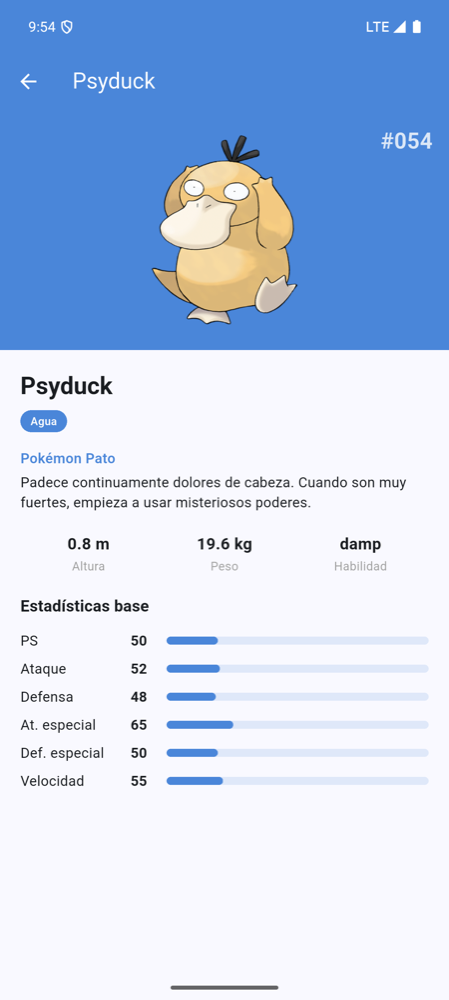
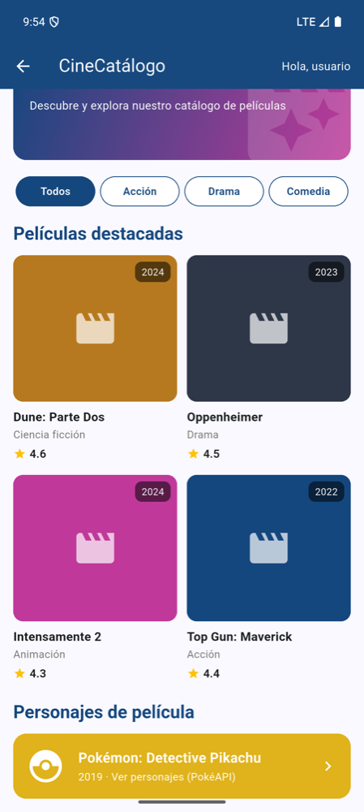
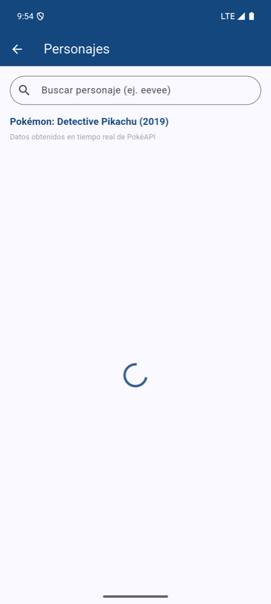
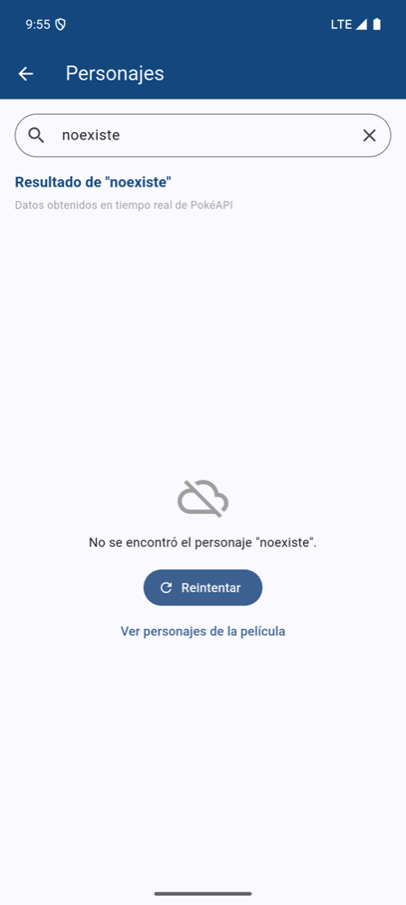
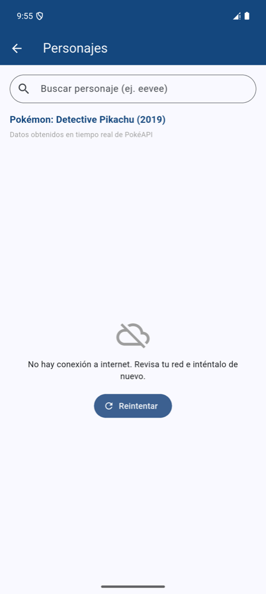
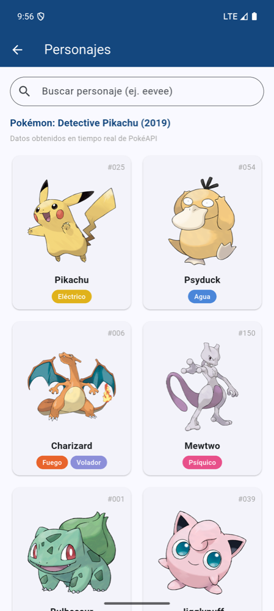

# LDSW_PeticionesHTTP — CineCatálogo

Aplicación móvil de catálogo de películas desarrollada en Flutter. En esta actividad la app **obtiene datos de internet con peticiones HTTP** a [PokéAPI](https://pokeapi.co): muestra los personajes de la película **"Pokémon: Detective Pikachu" (2019)**, permite buscar cualquier otro personaje y ver su detalle.

Continúa lo desarrollado en [LDSW_Widgets](https://github.com/tatiana1398/LDSW_Widgets) y [LDSW_Layouts](https://github.com/tatiana1398/LDSW_Layouts): Inicio → Catálogo → **Personajes de película** → Detalle.

- **Participante:** Tatiana Montenegro Domínguez
- **Asignatura:** Programación Móvil
- **Asesor(a):** Gabriel Peralta Domínguez

<p>



</p>

## ¿Por qué PokéAPI?

| API sugerida | Estado (octubre 2026) |
|---|---|
| Marvel Developer API | El portal de desarrolladores fue cerrado (redirige a marvel.com) y la API responde con error 500; ya no se pueden obtener claves. |
| COVID Tracking API | El proyecto terminó; los datos están congelados en marzo de 2021 y no tienen relación con un catálogo de películas. |
| OpenWeatherMap API | Requiere una clave personal (sin ella responde 401) y el clima no se relaciona con el catálogo. |
| **PokéAPI** | **Gratuita, sin clave, con imágenes.** Se integra al catálogo como los personajes de la película *Pokémon: Detective Pikachu*. |

## Procedimiento ("Obtener datos desde internet")

1. **Agregar el paquete `http`** en `pubspec.yaml` (`flutter pub add http`).
2. **Dar permiso de internet** en Android: `<uses-permission android:name="android.permission.INTERNET" />` en `android/app/src/main/AndroidManifest.xml`.
3. **Hacer la petición** con `http.get(...)` en [`lib/services/pokeapi_service.dart`](lib/services/pokeapi_service.dart).
4. **Convertir la respuesta** JSON en objetos Dart con `Personaje.fromJson` y `Especie.fromJson` en [`lib/models/personaje.dart`](lib/models/personaje.dart).
5. **Pedir los datos una sola vez** en `initState()` y guardar el `Future`.
6. **Mostrar los datos** con `FutureBuilder`: indicador de carga, vista de error con botón *Reintentar*, o la lista.

```dart
Future<Personaje> obtenerPersonaje(String nombre) async {
  final uri = Uri.parse('https://pokeapi.co/api/v2/pokemon/$nombre');
  final respuesta = await _client.get(uri).timeout(const Duration(seconds: 15));

  if (respuesta.statusCode == 200) {
    return Personaje.fromJson(jsonDecode(respuesta.body));
  }
  if (respuesta.statusCode == 404) throw PersonajeNoEncontrado(nombre);
  throw PokeApiException('El servidor respondió con el código ${respuesta.statusCode}.');
}
```

### Peticiones que hace la app

| Petición | Pantalla | Para qué |
|---|---|---|
| `GET /pokemon/{nombre}` ×8 (en paralelo con `Future.wait`) | Personajes | Personajes de la película: nombre, número, tipos e imagen |
| `GET /pokemon/{nombre}` | Personajes (buscador) | Buscar cualquier personaje |
| `GET /pokemon-species/{id}` | Detalle | Categoría y descripción **en español** |
| Imágenes (`Image.network`) | Personajes y Detalle | Arte oficial de cada personaje |

### Manejo de errores

- **404** → "No se encontró el personaje …" con botón para volver a la lista.
- **Sin conexión / tiempo agotado** → "No hay conexión a internet…" con botón **Reintentar**.
- **Otro código (500, etc.)** → mensaje con el código del servidor.
- Si una imagen no carga, se muestra un ícono de respaldo.

## Evidencias

Capturas en el emulador Android Pixel 9 Pro XL (API 35), con datos reales de PokéAPI ([`docs/evidencias`](docs/evidencias)):

| | | |
|---|---|---|
| <br>1. Inicio | <br>2. Catálogo con acceso a personajes | <br>3. Petición en curso |
| <br>4. Respuesta: 8 personajes | <br>5. Detalle (2.ª petición) | <br>6. Búsqueda "eevee" |
| <br>7. Error 404 | <br>8. Sin conexión | <br>9. Reintentar con red |

- [`log_peticiones_http.txt`](docs/evidencias/log_peticiones_http.txt): registro de las peticiones reales en el emulador (URL y código de respuesta).
- [`resultado_pruebas.txt`](docs/evidencias/resultado_pruebas.txt): `flutter analyze` sin errores y 9 pruebas aprobadas.

## Pruebas

[`test/widget_test.dart`](test/widget_test.dart) usa `MockClient` (de `package:http/testing.dart`) para simular las respuestas de PokéAPI sin depender de internet:

- Conversión del JSON a `Personaje` y `Especie` (textos en español).
- Respuestas 404, 500 y sin conexión.
- Pantalla de personajes: carga, lista, detalle, búsqueda y error.
- Sin desbordes en una pantalla pequeña.

## Estructura

```
lib/
├── main.dart                          # App, tema y colores
├── models/
│   ├── pelicula.dart                  # Películas del catálogo
│   └── personaje.dart                 # Personaje y Especie (fromJson)
├── services/pokeapi_service.dart      # Peticiones HTTP a PokéAPI
├── widgets/tipo_chip.dart             # Etiqueta de tipo (en español)
└── screens/
    ├── inicio_screen.dart             # Inicio (actividad de layouts)
    ├── catalogo_screen.dart           # Catálogo (actividad de widgets)
    ├── personajes_screen.dart         # Lista + buscador (FutureBuilder)
    └── personaje_detalle_screen.dart  # Detalle (2.ª petición)
```

## Cómo ejecutar

```bash
flutter pub get
flutter run          # en un emulador o dispositivo con internet
flutter test         # pruebas
flutter analyze      # análisis estático (sin errores)
```

### Material de apoyo

- [Obtener datos desde internet (Flutter)](https://docs.flutter.dev/cookbook/networking/fetch-data)
- [Paquete http](https://pub.dev/packages/http)
- [Documentación de PokéAPI](https://pokeapi.co/docs/v2)

Probado en el emulador Android Pixel 9 Pro XL (API 35) con Flutter 3.47.6 (Dart 3.13.5).
